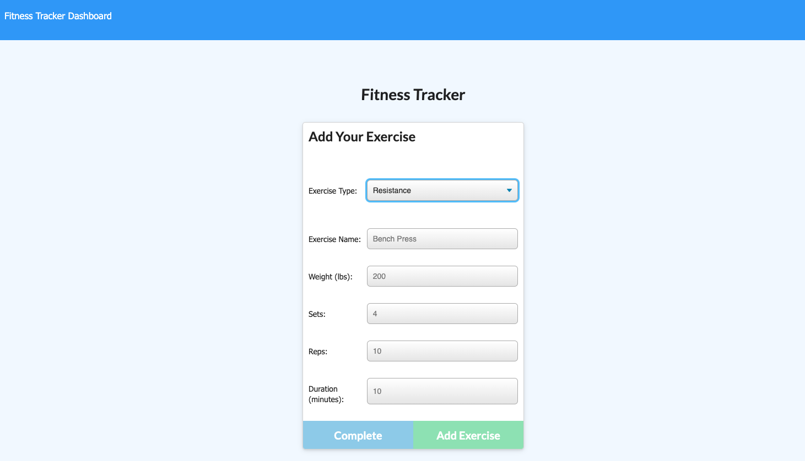
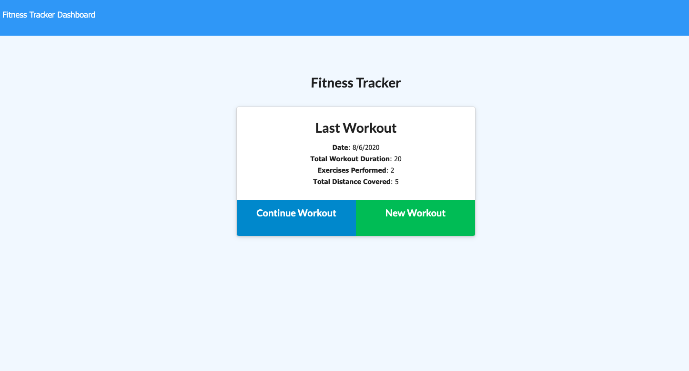
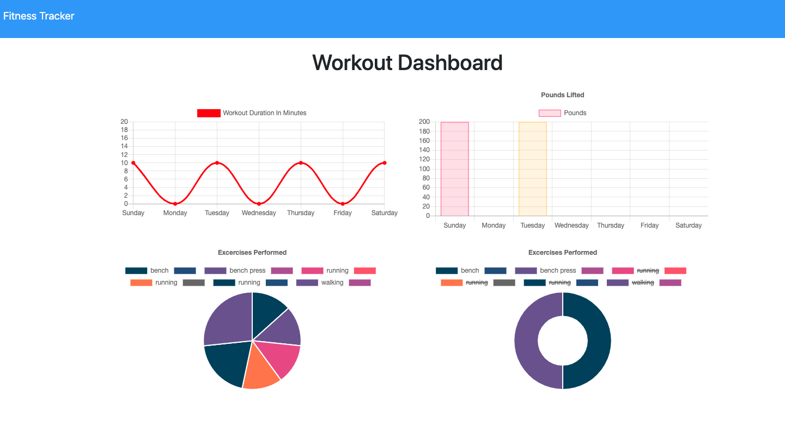

## Fitness-Tracker

## Description
This fitness tracker is designed for the user to be able to view and record various data relating to exercising.  The data to be tracked consists of the type of workout whether it be cardio or exercises with sets and repetitions.

## Business Context
A consumer will reach their fitness goals quicker when they track their workout progress.

## Technologies
Express
MongoDB
Mongoose
Morgan

## Features
User can add exercises to a previous workout plan
User can add new exercises to a new workout plan
User can view multiple combined weight of multiiple exercises on the stats page

## User Story
As a user, I want to be able to view create and track daily workouts. I want to be able to log multiple exercises in a workout on a given day. I should also be able to track the name, type, weight, sets, reps, and duration of exercise. If the exercise is a cardio exercise, I should be able to track my distance traveled.

Installation
1. Click on New Workout
2. Select exercise type: Resistance or Cardio
3. Enter exercise information
    a. Resistance: Exercise name, weight, sets, reps, duration
    b. Cardio: Exercise name, distance, duration
4. Click Add Exercise then Complete
5. Your last workout details will appear in the summary
6. To view your fitness tracker dashboard, click on the top left of the page where it says "Fitness Tracker Dashboard."

## Deployed Application

[Fitness Tracker](https://my-fitnesstracker.herokuapp.com/?id=5f2d92ff7e52d50017b064f1)

## Add Your Exercise

## Last Workout Summary

## Workout Dashboard

